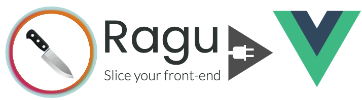

<p align="center" style="color: #343a40">
  <p align="center" >
    
  </p>
  <h1 align="center">Ragu React Server Adapter</h1>
</p>


[](https://coveralls.io/github/ragu-framework/ragu-vue-server-adapter?branch=main)


 

A Vue.js adapter for [Ragu Server - A micro-frontend framework](https://ragu-framework.github.io).

## Installation

```shell script
npm install ragu-server
npm install ragu-vue-server-adapter
```
